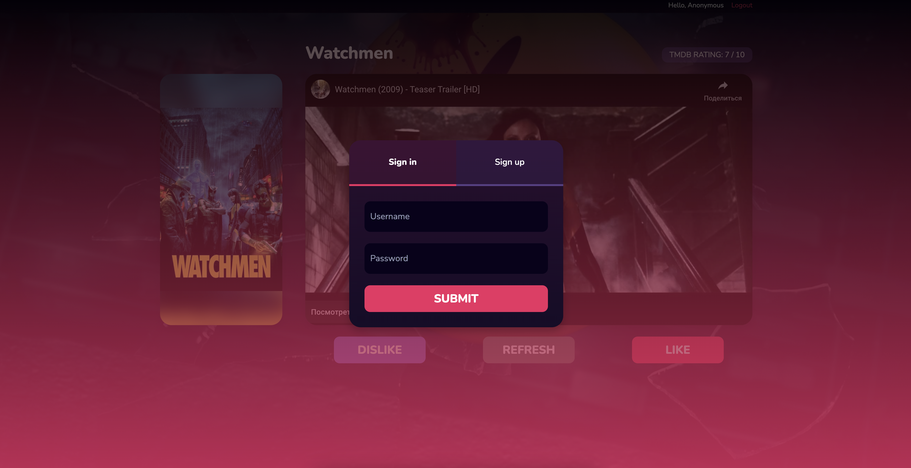

# MovieApp

Rate the trailers you are viewing, forming your favorite genres

When you first log in, you will need to log in

After successful authorization, you will have access to viewing trailers

- The API is taken as a basis themoviedb.org;
- Don't forget to specify your TMDB token inside the backend;
- To initialize the database inside the backend there is a command npm run init;
- The project was written in a day and a half;

#### Used:

- NestJS;
- MySQL / Prisma;
- PassportJWT;

- ReactJS;
- TailwindCSS;
- Tanstack – ReactQuery;
